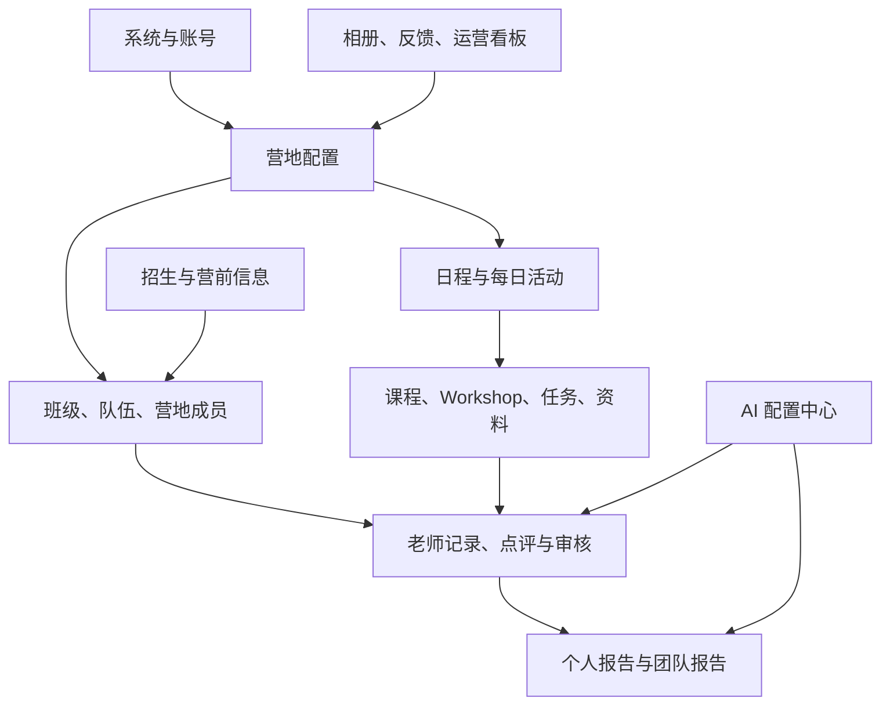

# 少年马斯克创业营：后台管理需求与原型索引

> 文档版本：v1.1（修正 V1.1 需求说明链接）  
> 更新日期：2026-06-23  
> 对应版本：V1.1 营地运营优化（REQ-101 至 REQ-120）  
> 关联文档：[V1.1 优化营地运营需求说明](少年马斯克创业营-V1.1优化营地运营需求说明.md)｜[需求池](少年马斯克创业营-需求池.md)｜[终极产品文档](少年马斯克创业营系统-终极产品文档.md)

## 1. 文档目的

本文件把当前后台管理需求、已存在的后台原型图和待补原型集中到同一处。它不是替代详细 PRD，而是用于快速回答四个问题：

1. 后台要管理什么业务对象。
2. 每个模块做到什么程度、处于什么开发状态。
3. 每项需求有哪些可参考的现有原型。
4. 哪些页面与规则仍需要补图或确认。

## 2. 后台信息架构

### 2.1 数据边界

| 层级 | 主数据 | 说明 |
| --- | --- | --- |
| 账号与人员 | `acc`、`per` | 登录认证与真实人员分离；账号、姓名、手机号均不作为关系主键 |
| 身份档案 | `stu`、`par`、`tch` | 学员、家长、老师的扩展档案；一个人员可按规则持有多个身份 |
| 组织关系 | `org`、`cls`、营地成员、队伍、教师职责 | 描述某人在哪一期营地、哪一个班级/队伍、承担什么职责 |
| 营地内容 | 日程、活动、课程、Workshop、任务、资料、相册 | 按营地和可见范围发布，日程作为共同时间锚点 |
| 成长输出 | 记录、点评、评分、个人报告、团队报告 | 以事实证据为先，AI 仅生成候选稿，人工审核后发布 |

## 3. V1.1 后台需求总表

| 需求 | 模块 | 优先级 | 计划 | 交付重点 | 原型状态 |
| --- | --- | --- | --- | --- | --- |
| REQ-101 | 后台信息架构与全局营地上下文 | P0 | 第 1-2 周 | 全局营地切换、面包屑、跨模块上下文 | 已有基础原型 |
| REQ-102 | 营地配置向导与完成度检查 | P0 | 第 1-3 周 | 创建后按人员、内容、日程、招生检查缺项 | 已有基础原型，需补向导图 |
| REQ-103 | 搜索、筛选、批量操作与状态提示 | P0 | 第 2-4 周 | 高效表格、批量处理、空态与错误回执 | 已有基础原型 |
| REQ-104 | 老师身份、负责范围与工作台 | P0 | 第 1-3 周 | 按带队/驻场/生活老师限制可见学员与待办 | 已有原型 |
| REQ-105 | 单个学员营地记录与证据附件 | P0 | 第 2-5 周 | 6 天 5 夜过程记录、评分、附件、事实证据 | 已有原型 |
| REQ-106 | 任务点评、六维成长评估与审核 | P0 | 第 3-5 周 | 六维五级分段评分、证据关联、原始点评、对外版本与审核可见范围 | 已有原型 |
| REQ-107 | AI 点评美化 | P0 | 第 4-5 周 | 模板化润色、原文对照、人工确认、调用留痕 | 已有原型 |
| REQ-108 | 招生表单与版本管理 | P0 | 第 1-4 周 | 字段配置、隐私分级、版本、适用营地 | 已有原型 |
| REQ-109 | 报名审核与数据质量 | P0 | 第 3-5 周 | 漏斗、退回补充、缺失项与审核记录 | 已有原型 |
| REQ-110 | 招生导入导出与错误明细 | P0 | 第 4-6 周 | Excel 模板、校验、错误下载、数据导出 | 已有原型 |
| REQ-111 | 内容包与发布节奏 | P1 | 第 3-6 周 | 课程、Workshop、任务、资料按营地日程发布 | 已有基础原型 |
| REQ-112 | 营期运营看板 | P1 | 第 5-8 周 | 报名、任务、记录、点评、相册、报告进度 | 待补专题原型 |
| REQ-113 | 用户管理与教师身份 | P0 | 第 1-3 周 | 学员/家长/老师账号，老师多教师类型 | 已有原型 |
| REQ-114 | 营地五态、容量与流转 | P0 | 第 1-3 周 | 未开营、招生中、已招满、开营中、已结营 | 已有原型 |
| REQ-115 | 队伍批量建队与导入 | P0 | 第 3-5 周 | A-Z 编号、成员/队长/带队老师校验 | 已有原型 |
| REQ-116 | 营地成员关系管理 | P0 | 第 2-5 周 | 用户加入某期营地后的班级、队伍与状态关系 | 已有原型 |
| REQ-117 | 老师/投资人评委邀请与最小授权 | P1 | 第 4-6 周 | 邀请链接、邀请海报、审核和数据边界 | 已有原型 |
| REQ-118 | 小鹅通课程同步与营地授权 | P1 | 第 5-8 周 | 同步目录、对象授权、第三方账号唯一关联 | 已有原型 |
| REQ-119 | 营地日程与每日活动流程 | P0 | 第 2-4 周 | 6 天 5 夜模板、日程发布、活动关联与变更通知 | 待补专题原型 |
| REQ-120 | AI 提示词、模型与密钥配置中心 | P1 | 第 5-8 周 | 个人/团队报告与点评模板、模型选择、密钥安全、审计 | 待补专题原型 |

## 4. 模块需求提炼

### 4.1 用户、身份与权限

**覆盖**：REQ-101、REQ-103、REQ-113、REQ-116、REQ-117。

- 用户管理只负责“用户是谁”：真实姓名、账号、手机号、出生日期、账号类型与教师类型。
- 账号类型为学员、家长、老师单选；只有老师显示教师类型，支持带队、驻场、生活、投资人评委多选。
- 营地成员关系负责“学员在哪一期营地”；不能把班级、队伍直接写入用户资料。
- 老师职责负责“老师在何处负责什么”；投资人评委在 V1.1 只完成邀请与最小访问边界，正式评分在 V1.2。
- 账号/人员/档案使用 `acc`、`per`、`stu`、`par`、`tch` 等前缀 UUIDv7；手机号、账号名称和姓名只用于展示、搜索、人工校验。

### 4.2 营地、班级、队伍与成员

**覆盖**：REQ-102、REQ-114、REQ-115、REQ-116、REQ-119。

- 营地使用五态：未开营、招生中、已招满、开营中、已结营。系统依据日期和容量提示，管理员确认状态切换。
- 有效报名人数仅统计“有效且未取消”的学员；容量由管理员配置。
- 队伍在“营地 + 班级”范围内编号唯一；支持批量创建空队和 Excel 导入完整分组。
- 队长必须是当前队伍成员且一队唯一；带队老师必须是教师类型包含“带队老师”的账号。
- 日程是营地内容的时间锚点：配置每日活动，再关联任务、Workshop、记录模板、相册分组和通知。

### 4.3 营地日程与每日活动流程（新增）

**后台页面建议**：营地详情 > `日程与活动` 页签。

| 页面区域 | 组件 | 说明 |
| --- | --- | --- |
| 日程导航 | 周视图 / 按天流程 / 模板管理 | 默认按 6 天 5 夜显示，可复制历史营地或某一天 |
| 每日流程 | 时段泳道 | 第一节至第五节、午休、晚间、自定义时段；显示时间冲突提示 |
| 活动编辑抽屉 | 基础信息与关联对象 | 日期、时间、类型、地点、负责人、参与范围、可见范围、发布状态 |
| 关联内容 | 课程、Workshop、任务、记录、相册、通知 | 一个活动可关联多个对象；变更保留版本 |
| 发布与通知 | 发布状态、变更标识、受影响人群 | 开营中改动时提醒老师、学员或家长；已结束活动只允许归档/更正 |

**6 天 5 夜模板基线**：

| 天数 | 核心主题 | 关键活动示例 |
| --- | --- | --- |
| 第 1 天 | 接营与适应 | 接营、破冰、团队建立、安全适应 |
| 第 2 天 | 激发梦想与组队 | 开营仪式、Idea Pitch、组队与角色分工 |
| 第 3 天 | 发现与定义问题 | 问题清单、用户旅程、市场调研 |
| 第 4 天 | 用户调研与 MVP | 用户访谈、MVP 构思与制作、推广方案 |
| 第 5 天 | 商业表达与路演准备 | 商业路演培训、PPT/视频/原型制作、彩排 |
| 第 6 天 | 路演与结营 | 正式路演、颁奖、总结与结营仪式 |

### 4.4 内容与学习授权

**覆盖**：REQ-111、REQ-118。

- 课程内容由小鹅通承载，后台负责目录同步、营地关联、学习对象和权益控制，不重复创建课程。
- 课程关联到日程活动后，可在活动卡片中向授权对象显示学习入口。
- 第三方账号映射保存平台用户唯一 ID；手机号仅可作为首次匹配线索。
- App ID、密钥和 IP 白名单仅允许管理员配置；学习数据同步和 H5 免登录以店铺已开通的接口权限为准。

### 4.5 老师记录、点评、报告与 AI

**覆盖**：REQ-104 至 REQ-107、REQ-120。

- 单个学员营地记录按活动和日期沉淀“事实、老师介入、学员回应、附件、关联维度”。能力评估统一采用创新思维、问题解决、团队协作、沟通表达、自我驱动、批判性思维六个维度。
- 每个维度使用初级、发展中、熟练、优秀、卓越五级定性评分，以六行五段式进度条呈现；每次选择必须关联事实、任务、作品或观察证据，允许标记“暂未观察”。
- 点评分为原始记录、AI 美化候选稿、老师确认稿和审核发布稿；AI 不得覆盖原文或直接发布。
- 个人报告使用该学员被授权的记录、任务、六维评估和作品证据；团队报告使用队伍可见的项目、任务和协作证据。两类报告分别配置提示词与输出结构，不能将团队表现直接归因给个人。
- 证据不足必须明确说明，不得补造事实、贴标签、做诊断或承诺结果。
- Day 1 至 Day 6 的日任务页作为日程、任务、记录与附件的共同入口；老师可在对应活动内沉淀观察，学员可提交任务，后台按同一活动归档。
- AI 报告编辑器支持报告列表筛选、结构化章节编辑、证据查看、局部重写/重新生成、版本对比、审核和发布；老师工作台仅展示其职责范围内的报告任务。

### 4.6 AI 配置中心（新增）

**后台页面建议**：系统管理 > `AI 配置中心`。

| 页签 | 管理对象 | 关键字段/动作 |
| --- | --- | --- |
| 模型连接 | 服务商与模型 | 服务商、模型 ID、受控 API 地址、超时、并发、额度、启停、测试连接 |
| 密钥托管 | API Key | 一次性录入、加密保存、掩码展示、轮换、停用、使用审计 |
| 提示词模板 | 点评美化、个人报告、团队报告 | 模板编码、版本、变量、系统提示词、输出结构、安全规则、适用模型 |
| 生成任务 | 具体调用 | 对象范围、证据范围、模板/模型版本、执行状态、失败原因、人工确认 |
| 调用审计 | 全部调用 | 操作人、时间、用量、结果摘要、敏感数据处理情况 |

**配置与安全规则**：

1. API Key 永不回显、永不写入前端、接口日志、下载文件或错误弹窗；采用密文或密钥管理服务引用存储。
2. 仅平台管理员可录入、轮换、停用密钥；AI 配置管理员维护已授权模型和模板；营地管理员仅使用已启用配置。
3. 模板修改产生新版本，历史报告、点评和调用保留原版本快照。
4. 模型地址必须来自允许列表；测试连接只使用脱敏样例，不使用真实未成年人数据。
5. 每次生成绑定营地、对象范围、模板版本、模型配置版本和操作者；失败时允许人工继续撰写或稍后重试。
6. 报告模板需分别定义个人报告和团队报告的输入范围、证据摘要格式、优势/建议输出及“证据不足”处理，不得生成对外排名、淘汰结论或标签化判断。

### 4.6.1 Stitch 设计功能页对齐记录

来源：[Stitch 设计功能页 Demo](https://stitch.withgoogle.com/projects/4941859941062440100)。已纳入需求的核心页面包括：

| 设计页 | 对齐需求 | 落地原则 |
| --- | --- | --- |
| 学生行为记录与点评（6维度5等级优化版） | REQ-105、REQ-106 | 六维五级评分必须附证据；评分与对外点评、内部备注分层 |
| Day 1 至 Day 6 今日任务 | REQ-105、REQ-119 | 每日任务绑定营地日程活动，统一关联记录、任务提交和附件 |
| AI 报告生成与管理中心（编辑器优化版） | REQ-120 | 报告草稿可编辑、可追溯证据和版本，审核后发布 |
| 老师营地操作台 - AI 报告集成工作台 | REQ-104、REQ-120 | 仅展示老师职责范围内的待处理报告和生成入口 |
| 师资管理 - 邀请链路与 AI 提示词配置 | REQ-117、REQ-120 | 老师邀请与 AI 配置分权；密钥、模型和全局模板仅限后台授权管理员 |

### 4.7 招生、营前信息、相册与运营看板

**覆盖**：REQ-108 至 REQ-112。

- 可配置成长档案、营地信息、安全健康、营服尺码等表单，并对敏感字段分级。
- 支持报名审核、退回补充、填写进度、数据质量、Excel 导入导出和错误明细。
- 相册、反馈、课程、任务、记录、报告等运营数据统一按营地统计；家长只看已审核、已发布信息。

## 5. 原型图索引

### 5.1 后台核心原型

| 编号 | 原型图 | 对应后台模块 | 关联需求 |
| --- | --- | --- | --- |
| 13 | [后台营地基础配置.png](key-page-prototypes/13-后台营地基础配置.png) | 营地基础信息与配置入口 | REQ-102、REQ-114、REQ-119 |
| 14 | [后台内容配置.png](key-page-prototypes/14-后台内容配置.png) | 内容、课程、任务配置 | REQ-111 |
| 15 | [后台记录与报告管理.png](key-page-prototypes/15-后台记录与报告管理.png) | 记录、报告、审核 | REQ-105 至 REQ-107、REQ-120 |
| 16 | [后台相册反馈管理.png](key-page-prototypes/16-后台相册反馈管理.png) | 相册、家长反馈 | REQ-112 |
| 17 | [后台用户管理.png](key-page-prototypes/17-后台用户管理.png) | 用户与教师身份 | REQ-113 |
| 18 | [营地状态管理.png](key-page-prototypes/18-营地状态管理.png) | 五态营地、容量和状态流转 | REQ-114 |
| 19 | [队伍管理批量建队.png](key-page-prototypes/19-队伍管理批量建队.png) | 队伍列表与批量建队 | REQ-115 |
| 20 | [队伍详情与成员管理.png](key-page-prototypes/20-队伍详情与成员管理.png) | 队伍详情与成员配置 | REQ-115、REQ-116 |
| 21 | [营地成员关系管理.png](key-page-prototypes/21-营地成员关系管理.png) | 学员加入营地后的关系 | REQ-116 |
| 22 | [老师与投资人评委管理.png](key-page-prototypes/22-老师与投资人评委管理.png) | 师资账号、邀请、授权 | REQ-117 |
| 23 | [投资人评委邀请海报.png](key-page-prototypes/23-投资人评委邀请海报.png) | 投资人邀请海报 | REQ-117 |
| 24 | [投资人评委详情.png](key-page-prototypes/24-投资人评委详情.png) | 评委数据边界与详情 | REQ-117 |
| 25 | [课程管理与营地授权.png](key-page-prototypes/25-课程管理与营地授权.png) | 小鹅通课程与营地授权 | REQ-118 |
| 26 | [小鹅通第三方平台授权.png](key-page-prototypes/26-小鹅通第三方平台授权.png) | 第三方平台授权 | REQ-118 |
| 27 | [小鹅通课程详情.png](key-page-prototypes/27-小鹅通课程详情.png) | 课程信息、授权、学习数据 | REQ-118 |

### 5.2 后台关联及老师工作台原型

| 编号 | 原型图 | 用途 |
| --- | --- | --- |
| 09 | [AI点评与报告生成.png](key-page-prototypes/09-AI点评与报告生成.png) | AI 点评与报告交互参考 |
| 34 | [老师营地信息后台详情.png](key-page-prototypes/34-老师营地信息后台详情.png) | 老师查看营地信息与权限范围 |
| 35 | [入营前准备总览.png](key-page-prototypes/35-入营前准备总览.png) | 营前配置完成度与运营总览参考 |
| 38 | [营前问卷报名审核.png](key-page-prototypes/38-营前问卷报名审核.png) | 报名审核与问卷数据参考 |
| 40 | [路演家长出席管理.png](key-page-prototypes/40-路演家长出席管理.png) | 家长活动运营参考 |
| 44 | [老师营地操作台.png](key-page-prototypes/44-老师营地操作台.png) | 当前活动、任务和记录入口参考 |
| 47 | [每日学生行为记录.png](key-page-prototypes/47-每日学生行为记录.png) | 每日营地记录参考 |
| 48 | [AI每日报告.png](key-page-prototypes/48-AI每日报告.png) | AI 日报输出参考 |
| 49 | [整体成长报告生成.png](key-page-prototypes/49-整体成长报告生成.png) | 成长报告生成参考 |
| 50 | [老师学生记录操作台.png](key-page-prototypes/50-老师学生记录操作台.png) | 老师对学生记录操作参考 |
| 51 | [Day1-入营仪式学生记录.png](key-page-prototypes/51-Day1-入营仪式学生记录.png) | 日程活动关联记录参考 |
| 52 | [Day3-问题洞察学生记录.png](key-page-prototypes/52-Day3-问题洞察学生记录.png) | 日程活动关联记录参考 |
| 57 | [AI报告老师工作台.png](key-page-prototypes/57-AI报告老师工作台.png) | 老师确认 AI 报告参考 |

### 5.3 待补后台原型

| 页面 | 关联需求 | 应重点表达 |
| --- | --- | --- |
| 营地日程与活动流程配置 | REQ-119 | 周视图、按天时段、活动编辑抽屉、内容关联、发布/变更通知、冲突提醒 |
| AI 配置中心 | REQ-120 | 模型连接、密钥掩码与轮换、模板版本、个人/团队报告模板、测试连接、调用审计 |
| 营期运营看板 | REQ-112 | 报名、填表、日程、任务、记录、点评、报告、相册的实时进度与预警 |
| 营地配置向导 | REQ-102 | 从营地基础信息到日程、人员、内容、招生的完成度检查与跳转修复 |

## 6. 交付与验收顺序

1. **第 1-3 周**：用户、营地五态、营地配置向导、老师范围、招生表单、UUID 主数据边界。
2. **第 2-5 周**：日程活动流程、营地成员关系、队伍、个人记录、任务点评与审核。
3. **第 4-6 周**：AI 点评美化、师资邀请、数据导入导出、内容发布节奏。
4. **第 5-8 周**：AI 配置中心、个人/团队报告模板、小鹅通授权、运营看板。

## 7. 当前待确认事项

| 主题 | 待确认内容 |
| --- | --- |
| 营地日程 | 6 天 5 夜标准模板的最终版本、活动时段命名、对家长公开的日程粒度、活动变更通知方式 |
| AI 服务商 | 可选服务商和模型、密钥托管方式、额度预算、并发限制、数据处理地域与未成年人隐私要求 |
| AI 报告 | 个人报告/团队报告的固定章节、必填证据、审核角色、发布时机与撤回规则 |
| 小鹅通 | 当前店铺实际开放的授权、权益、学习数据、H5 免登录接口权限 |
| 运营看板 | 指标口径、预警阈值、看板查看角色与导出范围 |
