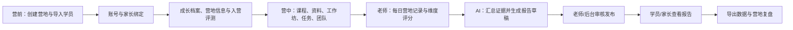

# 少年马斯克创业营系统：终极产品文档

> 文档版本：v1.1  
> 更新日期：2026-06-22  
> 文档定位：产品、运营、设计、研发共用的业务基线与版本规划依据  
> 资料整合自：《少年马斯克创业营-产品文档》《少年马斯克创业营系统-关键规则确认》《少年马斯克创业营-产品需求四视角梳理》《少年马斯克创业营系统PRD-落地版》及《营地记录表设计方案》。

## 0. 文档使用方式

- 本文档定义产品目标、范围、核心规则、关键流程及版本边界。
- 具体功能的开发状态、优先级、目标版本、排期与验收口径，以《少年马斯克创业营-需求池》为准。
- 当业务规则与旧设计稿冲突时，以本文件“已确认规则”为准；尚未确认的内容进入需求池或待确认清单。

## 1. 产品定义

### 1.0 当前版本基线

截至 2026-06-22，系统的 **V1.0 后台 Web 已上线运行**。已具备系统用户、营地、班级、营员、老师、队伍、课程、Workshop、任务、报名审核、问卷链接、素材、营地相册、家长反馈和学生 Idea 等基础模块。该判断以已上线后台界面为证据，仍需按真实营地流程完成业务验收。

学员、家长、老师客户端目前已有登录注册、信息填写、营地首页、课程/任务/资料、团队、相册、反馈和 Idea 等设计资产；**这些设计稿不等同于已上线能力**，是否纳入后续版本需按需求池排期。

### 1.1 一句话定义

少年马斯克创业营系统是一个服务创业营全周期的多角色营地管理平台：用后台完成营地运营配置，用移动 Web/H5 支撑学员、老师、家长在营前、营中、营后的协作与成长沉淀。

### 1.2 解决的问题

| 场景 | 现状问题 | 系统要解决的事 |
| --- | --- | --- |
| 营前 | 报名、成长档案、营地信息分散在多个表单 | 统一学员主账号、信息收集、完成状态和运营导入 |
| 营中 | 课程、任务、资料、团队信息分散；老师观察难沉淀 | 让学员知道“今天做什么”，让老师快速记录可追溯证据 |
| 营后 | 反馈报告产出依赖人工，家长缺少可靠的成长回顾 | 基于真实记录、任务和作品生成审核后的成长报告 |
| 运营 | 营地配置、人群关系、内容发布和导出流程不统一 | 形成可复用的营地配置模板和可追踪的数据闭环 |

### 1.3 产品形态

| 端 | 形态 | 主要用户 | 主要职责 |
| --- | --- | --- | --- |
| 管理后台 | Web | 定义管理员、运营、教务 | 配置营地、人员、内容、权限、审核、导入导出 |
| 学员端 | 移动 Web/H5，自适应桌面 | 学员 | 填写信息、学习、提交任务、管理项目、查看报告 |
| 老师端 | 移动 Web/H5，自适应桌面 | 带队老师、生活老师、驻场导师 | 查学员、记录表现、评分点评、生成报告草稿 |
| 家长端 | 移动 Web/H5，自适应桌面 | 家长/监护人 | 绑定孩子、查看已发布报告、课程、相册和反馈结果 |

### 1.4 非目标

- 本期不把小组营地记录作为核心模块；小组协作数据可由任务、项目和后续小组模块补充。
- AI 不替代老师判断，不可直接向家长发布报告。
- 不建设开放式社交社区；项目 fork 仅在营地内、基于可见范围发生。

## 2. 角色、账号与数据边界

### 2.1 账号体系

1. **学员是主账号**。学员本人可创建，也可由家长代为创建。
2. 家长以独立账号存在，通过学员注册手机号或姓名发起绑定；重名时须补充手机号或进入人工确认。
3. 后台可修改、解绑、重新绑定家长与学员的关系，并保留变更日志。
4. 老师与管理员均由后台创建和授权，不开放自注册。
5. 一个家长可绑定多个学员；一个学员可有多个授权监护人，具体数量由后台策略控制。

### 2.2 权限矩阵

| 角色 | 数据范围 | 可操作 | 明确不可见/不可操作 |
| --- | --- | --- | --- |
| 学员 | 自己所属营地及自己的内容 | 填信息、看课程资料、提交/修改任务、管理自己的项目、看已发布报告 | 他人原始记录、未发布报告、非公开项目 |
| 家长 | 已绑定学员 | 看课程、相册、公开点评、任务结果、已发布报告；提交反馈 | 老师原始记录、未审核报告、其他学员信息、隐私档案正文 |
| 带队老师 | 负责队伍学员 | 查学员、填写营地记录、参与点评、生成报告草稿 | 非负责队伍信息、后台权限配置 |
| 生活老师 | 当前营地全部人员 | 查基础和安全信息、填写生活/自理记录 | 发布报告、修改系统权限 |
| 驻场导师 | 所带班级学员 | 查看班级学员、填写记录、参与点评、生成草稿 | 非所带班级信息 |
| 定义管理员 | 授权营地的全部信息 | 配置营地、导入导出、审核发布报告、改绑家长、配置权限 | 受超级管理员控制的系统级能力 |

### 2.3 隐私规则

- 身份证、住址、电话、健康、过敏、接送、尺码等信息仅限授权老师与后台业务使用。
- 这些信息不进入家长端报告正文，也不作为 AI 报告对外表述素材。
- 家长可见内容必须满足“已审核并发布”的状态。

## 3. 全生命周期业务闭环

### 3.1 后台标准运营顺序

1. 创建营地与期次。
2. 导入或创建学员主账号。
3. 创建/邀请家长并完成绑定。
4. 导入老师，配置班级、队伍与负责老师。
5. 发布课程、资料、工作坊、任务和项目规则。
6. 营期中完成营地记录、任务点评与素材审核。
7. 营期末生成、审核、发布成长报告。
8. 导出报告、学员数据、任务提交情况、点评信息，完成复盘。

## 4. 信息架构与核心页面

### 4.1 后台 Web

| 一级模块 | 关键能力 |
| --- | --- |
| 运营首页 | 当前营地进度、待配置项、信息收集完成率、待审核报告、待处理反馈 |
| 营地与期次 | 营地基础信息、状态、封面、时间、归档 |
| 人员与关系 | 学员、家长、老师、管理员、角色、绑定关系、变更日志 |
| 信息收集 | 表单配置、填写进度、退回修改、导出 |
| 内容与任务 | 课程、资料、工作坊、任务、截止时间、发布状态、提交统计 |
| 队伍与项目 | 班级、队伍、队长、成员、负责老师、创业项目关系 |
| 记录与报告 | 营地记录、维度评分、AI 草稿、审核发布、撤回、导出 |
| 相册与反馈 | 相册分组、展示范围、反馈工单和处理状态 |
| 导入导出 | Excel 模板、导入结果、错误明细、数据导出任务 |

### 4.2 学员端

| 页面 | 核心任务 |
| --- | --- |
| 首页 | 当前营地、信息收集进度、课程、任务、项目、团队、报告入口 |
| 任务 | 查看任务、截止前修改提交、查看老师已发布点评 |
| 项目/创业想法 | 新建项目、从自己的 idea 建分支、fork 可公开想法、查看来源关系 |
| 报告 | 查看已发布成长报告 |
| 我的 | 个人档案、账号信息、家长绑定状态 |

### 4.3 老师端

| 页面 | 核心任务 |
| --- | --- |
| 工作台 | 待记录学员、待点评任务、待生成报告 |
| 学员 | 搜索筛选、学员详情、责任范围校验 |
| 营地记录 | 为单个学员创建每日记录、关键事件、维度评分、证据素材 |
| 报告 | 选择素材、生成 AI 草稿、编辑、提交审核或发布 |
| 我的 | 个人资料、负责范围 |

### 4.4 家长端

| 页面 | 核心任务 |
| --- | --- |
| 首页 | 切换绑定孩子，查看营地动态、课程、相册、报告入口 |
| 报告 | 查看已审核发布的成长报告 |
| 反馈 | 提交问题、上传图片、查看处理进度 |
| 我的 | 个人资料、绑定关系、账号设置 |

## 5. 关键业务规则

### 5.1 信息收集

- 学员在营前完成成长档案、营地信息及入营评测；支持草稿、提交、退回修改、锁定。
- 后台支持动态表单字段配置，首期优先接入既有成长档案和营地信息收集表。
- 信息收集进度是进入营地运营工作台的重要提醒，不以是否完成作为唯一入营门槛，具体由营地策略配置。

### 5.2 任务提交与点评

- 学员可在截止时间前反复修改提交；截止后锁定学员编辑。
- 截止后由老师点评；AI 可生成建议，最终点评必须由老师确认。
- 提交内容支持文本、图片及受控文件类型；任务状态至少包含未开始、草稿、已提交、已截止、已点评。

### 5.3 创业项目与 idea 演进

- 学员可新建创业项目。
- 可从自己的历史 idea 创建分支，保留父子来源。
- 可 fork 他人的公开 idea，fork 后独立编辑并保留来源；原作者可见范围决定能否被 fork。
- 项目应记录标题、领域、问题、用户、解决方案、市场、竞品、计划书/附件及版本历史。

### 5.4 营地记录

营地记录以**单个学员**为对象，分为四类数据：

1. 每日观察记录：活动、参与状态、关键表现、困难、老师介入、学员回应、素材、关联维度、一句话总结。
2. 关键事件：高光表现、困难突破、团队协作、主动担当、创意表达、情绪变化、生活自理等可进入报告的事件。
3. 能力测评：以证据为前提的创业者评选维度评分。
4. 报告素材确认：控制哪些记录可被 AI 使用和是否进入最终报告。

### 5.5 6 天 5 夜观察主线

| 天数 | 主题 | 重点观察 |
| --- | --- | --- |
| 第 1 天 | 接营与适应 | 安全感、自理能力、适应力、初始社交 |
| 第 2 天 | 激发梦想与组队 | 表达意愿、兴趣、团队角色、主动性 |
| 第 3 天 | 问题发现与定义 | 问题意识、理解力、调研、解决问题 |
| 第 4 天 | 用户调研与 MVP | 用户意识、设计思维、动手能力、协作 |
| 第 5 天 | 商业路演准备 | 逻辑组织、表达、坚持、责任感 |
| 第 6 天 | 路演与结营 | 自信展示、项目表达、反思和综合成长 |

### 5.6 创业者评选维度

日常记录采用 1-4 分量表：1 待激发、2 发展中、3 达标、4 卓越；营期总结采用 18 个指标、满分 72 分。

| 一级维度 | 指标 |
| --- | --- |
| 问题发现力 | 真实问题识别、用户需求理解、问题定义清晰度 |
| 创新解决力 | 创意独特性、方案可行性、迭代能力 |
| 商业思维 | 价值主张、市场与竞品意识、商业表达 |
| 执行与交付 | 任务完成度、作品/原型质量、时间管理 |
| 团队协作与领导力 | 角色承担、沟通协作、团队影响力 |
| 创业者心智 | 自信表达、韧性与坚持、责任感与使命感 |

| 分数 | 结论 |
| --- | --- |
| 60-72 | 创业领航者 |
| 48-59 | 创业实践者 |
| 36-47 | 创想探索者 |
| 18-35 | 潜力萌芽者 |

### 5.7 AI 成长报告（V1.4 规划）

- 本能力在 V1.4 建设；在此前版本中，老师点评和人工报告流程应可独立运行。
- 输入来源：经授权的信息收集摘要、营地记录、关键事件、维度评分、任务提交、创业项目、老师点评及学习/生活表现。
- 每一个核心评价必须可追溯到证据，不得编造事件。
- AI 只生成草稿、点评建议和素材摘要；老师或管理员完成审核后才可发布。
- 报告向学员和家长呈现优势、成长方向、事实证据和可执行建议；不泄露隐私字段和老师原始记录。
- 报告状态：未生成、生成中、生成失败、草稿、待审核、已发布、已撤回。

## 6. 数据对象与技术基线

### 6.1 核心对象

| 对象 | 关键字段/关系 |
| --- | --- |
| 营地与期次 | 名称、时间、状态、封面、班级、队伍、内容 |
| 用户与角色 | 账号、角色、状态、授权营地/班级/队伍 |
| 学员档案 | 学员主账号、基础信息、信息收集、入营评测、隐私分级 |
| 家长绑定 | 家长、学员、关系、状态、创建人、变更日志 |
| 内容资源 | 课程、资料、工作坊、任务、附件、展示范围、发布状态 |
| 提交与项目 | 任务提交、项目、分支/ fork 来源、版本、点评 |
| 营地记录 | 每日记录、关键事件、评分、证据素材、报告引用状态 |
| 成长报告 | 生成素材、草稿、审核人、发布状态、可见范围 |
| 运营数据 | 导入任务、导出任务、反馈工单、审核日志 |

### 6.2 系统能力边界

- 前端：用户端 H5 与后台 Web 分离；用户端按角色渲染不同工作台。
- 服务：认证与 RBAC、营地域服务、内容任务服务、项目版本服务、记录报告服务、文件服务、导入导出服务。
- 文件：需支持图片、文档、任务附件、计划书，进行类型、大小、权限和审计控制。
- 数据隔离：所有核心查询以营地为第一层过滤，再叠加角色、班级、队伍和绑定关系。
- AI（V1.4）：采用“检索结构化证据 → 生成草稿 → 人工审核”的链路，保留素材引用和生成版本。

## 7. 运营、交互与体验原则

### 7.1 运营原则

- 把配置顺序产品化：未完成前置配置时，后台给出下一步引导与缺失提醒。
- Excel 批量导入必须提供模板、字段校验、成功/失败统计和错误明细导出。
- 导出至少覆盖报告、学员档案与绑定、任务提交、点评与记录情况。
- 关键运营指标：资料完成率、任务按时提交率、老师记录覆盖率、报告按时发布率、家长反馈处理时效。

### 7.2 交互原则

- 学员端以“今日要做什么”为优先级，减少复杂后台概念。
- 老师端以“快速记录、可回溯证据”为优先级，日常填写不强制穷举所有维度。
- 家长端以“已审核、易理解、保护隐私”为优先级，不暴露原始观察记录。
- 后台以“表格、筛选、批量操作、状态追踪”为核心，减少重复录入。
- 所有发布、解绑、移除队员、撤回报告、删除素材等风险操作需二次确认并留痕。

## 8. 版本策略与里程碑

> 版本先后顺序已确认；具体日期、负责人和研发容量进入排期后再在需求池中更新，不把当前估算当作研发承诺。

### 8.1 V1.0：已上线后台能力基线

| 领域 | 已上线能力 | 当前判断 |
| --- | --- | --- |
| 系统与用户 | 用户管理、角色与系统基础能力 | 已上线，需核验租户、角色和数据权限是否符合营地业务 |
| 营地组织 | 营地、班级、营员、老师、队伍管理 | 已上线，需按“营地 - 班级 - 队伍 - 人员 - 老师”关系完成端到端验收 |
| 营地内容 | 课程、Workshop、任务、素材资料 | 已上线，需补齐内容发布、提交记录与营期日程的运营口径 |
| 招生与触达 | 报名审核、问卷链接、营地相册、家长反馈、学生 Idea | 已上线，表单数据结构、报名漏斗和结果导出仍需优化 |
| 用户客户端 | 学员、家长、老师端设计稿 | 已设计待开发，不计入 V1.0 上线完成度 |

V1.0 的收尾不是新增大功能，而是完成真实营地验收、梳理数据缺口、清理重复操作，并形成 V1.1 的改造基线。

### 8.2 V1.1：后台体验、老师点评、营地组织与招生信息优化

目标：以后台 Web 为中心，提升营地内的管理效率与内容输出质量。

| 重点 | 交付方向 |
| --- | --- |
| 后台管理体验 | 全局营地上下文、信息架构整理、跨模块筛选搜索、批量操作、状态与空态提示、配置完成度引导 |
| 老师点评系统 | 按老师身份控制数据范围；学员成长档案、任务点评、营地记录、评分模板、证据附件、审核与对外可见范围 |
| 点评 AI 美化（轻量） | 基于固定提示词模板和受控 AI 接口，将老师已填写的事实性点评润色为适合学生/家长阅读的表达；老师逐条确认后才能保存或发布 |
| 招生信息收集 | 可配置表单与版本、敏感字段分级、报名审核流、填写进度、退回补充、导入导出、数据质量校验 |
| 用户与营地组织 | 学员/家长/老师账号身份、教师类型、五态营地、营地成员关系、批量建队及导入校验 |
| 师资与第三方课程 | 老师邀请、投资人评委身份与邀请基础；小鹅通课程同步、营地授权和第三方账号唯一 ID 关联 |
| 营地运营与内容输出 | 课程/Workshop/任务/素材的关联发布、营期内容包、提交与点评汇总、相册与内容产物沉淀、运营看板 |

### 8.3 V1.2：顾问老师与投资人评委

目标：支持营地之外的专业反馈和项目评审，并保持数据最小可见原则。

- **顾问老师**：按营地、班级、队伍或项目被授权；查看限定资料，给出项目/学员建议，不拥有后台配置及隐私档案权限。
- **投资人评委**：按评审场次和项目范围分配；使用统一评分表、评语与锁定机制，可输出排名、评审结果及汇总导出。
- **治理要求**：记录授权范围、评分版本、评委操作日志和结果发布时间；支持回避关系与匿名评审策略配置。

### 8.4 V1.3：游戏化与积分系统

目标：让学习投入、团队协作和成长行为获得连续反馈，而不是制造单一排名压力。

- 配置积分规则、积分流水、审核/撤销与异常处理。
- 将任务完成、课堂参与、团队协作、主动担当等行为映射为徽章、成就和成长进度。
- 提供个人成长视图与可配置的队伍榜单；默认保护未成年人隐私，公开排名须由营地策略开启。

### 8.5 V1.4：嵌入 AI

目标：在人工判断和证据链完整的前提下，提升老师、运营和学员的内容处理效率。

- AI 点评助手：提取记录证据、生成老师点评候选稿，不可自动发布；V1.1 的轻量点评美化能力在此基础上升级为可引用证据的助手。
- AI 报告助手：汇总授权数据生成成长报告草稿，老师/管理员审核后发布。
- AI 内容助手：辅助生成课程、任务、Workshop 和运营文案初稿。
- AI 表单助手：辅助识别信息缺失、提示补充和归类；不替代人工审核。
- 所有 AI 能力必须具备授权校验、引用证据、人工确认、生成版本、操作审计和失败降级机制。

## 9. 验收基线

### 9.1 V1.0 与 V1.1 验收重点

1. V1.0 已上线模块可按营地真实组织关系完成新增、编辑、筛选、状态变更和权限核验。
2. V1.1 后台能明确显示当前营地、配置完成度、待处理事项和跨模块关联信息，减少运营人员重复录入。
3. 老师只能查看被授权的学员范围，并能完成带证据的记录、任务点评和维度评分；对外展示内容必须经过审核。
4. 老师可使用 V1.1 的“AI 美化”按钮对已填写点评进行润色：输入仅限当前点评和选定模板，不自动补写事实；结果必须由老师确认并保留原文与美化版本。
5. 招生/信息收集支持表单版本、填写进度、退回补充、隐私分级及结果导入导出。
6. 后台能导出学员、报名/信息收集、任务提交、点评与运营内容产出，且导出范围服从权限。

### 9.2 上线前必须确认

- 账号绑定是否需要后台人工审核的触发条件。
- 信息收集表最终字段、敏感字段访问级别、是否允许营期后修改。
- 任务截止时间、允许补交和老师点评 SLA。
- 项目公开、分支与 fork 的具体可见性策略。
- V1.1 老师点评的可见范围、审核责任人和营期内点评 SLA。
- V1.2 顾问老师、投资人评委的授权范围、回避规则和评审流程。
- V1.3 积分规则、公开榜单策略与奖励兑现边界。
- V1.4 AI 模型、隐私授权、生成失败重试与内容审核责任人。
- 各版本实际研发人力与排期。

## 10. 变更记录

| 版本 | 日期 | 说明 |
| --- | --- | --- |
| v1.0 | 2026-06-22 | 合并四份产品资料，纳入已确认规则、营地记录与版本策略 |
| v1.1 | 2026-06-22 | 依据上线后台与客户端设计资产重划版本：V1.0 为已上线基线；V1.1 聚焦后台体验、老师点评、招生信息与内容运营，并提供提示词模板加 AI 接口的轻量点评美化；V1.2 至 V1.4 依次扩展评委、游戏化和完整 AI 能力 |
